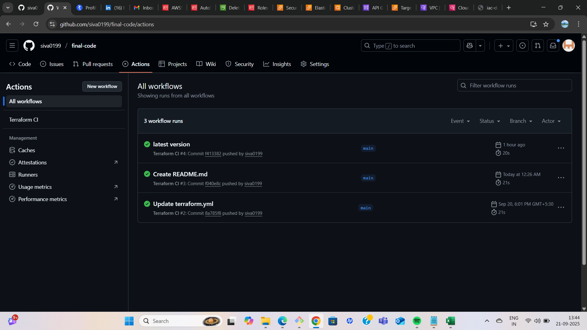

# DevOps / IaC Production Demo on AWS with Terraform

This project demonstrates a small, production-ready infrastructure on AWS, provisioned entirely using Terraform. It showcases best practices for modular Infrastructure as Code (IaC), including networking, container orchestration, load balancing, serverless APIs, and security.

## Table of Contents
- [Architecture Overview](#architecture-overview)
- [Key Features](#key-features)
- [Project Structure](#project-structure)
- [Prerequisites](#prerequisites)
- [Deployment Instructions](#deployment-instructions)
- [Testing and Verification (Proof of Deployment)](#testing-and-verification-proof-of-deployment)
- [CI/CD Pipeline](#cicd-pipeline)
- [Security Considerations](#security-considerations)
- [Cleanup](#cleanup)
- [Appendix: Detailed Screenshots](#appendix-detailed-screenshots)

## Architecture Overview

The infrastructure is designed to be secure, scalable, and resilient. It consists of a custom VPC with multiple subnets, an ECS cluster for containerized services, an Application Load Balancer for traffic distribution, and a serverless API for file uploads.

```
graph TD
    subgraph "AWS Cloud (us-east-1)"
        subgraph "VPC (10.0.0.0/16)"
            subgraph "Public Subnets"
                ALB[Application Load Balancer]
            end

            subgraph "Private App Subnets"
                ECS_Cluster[ECS Cluster - EC2 Instances]
                ECS_Service_A[Nginx Service A]
                ECS_Service_B[Nginx Service B]
            end

            subgraph "Private Data Subnets"
                NAT[NAT Gateway]
            end

            APIGW[API Gateway HTTP API] --> Lambda[Python Lambda]
            Lambda --> S3[S3 Bucket]
        end

        User --> ALB
        ALB -- Round-Robin --> ECS_Service_A
        ALB -- Round-Robin --> ECS_Service_B

        User -- /upload --> APIGW
    end

    style S3 fill:#f2b447
    style Lambda fill:#f58535
    style APIGW fill:#ff4f8b
    style ECS_Cluster fill:#2e73b8
```

## Key Features

- **Modular Terraform Code**: Infrastructure is defined in reusable modules (`vpc`, `iam`, `ecs`, `alb`, `lambda`).
- **Secure Networking**: A custom VPC with public subnets for external-facing resources (ALB) and private subnets for internal services (ECS instances).
- **Container Orchestration**: An ECS cluster running on an EC2 Auto Scaling Group hosts two distinct `nginx` services.
- **Load Balancing**: An Application Load Balancer performs round-robin traffic distribution between the two `nginx` services.
- **Serverless API**: A secure file upload endpoint using API Gateway and a Python Lambda function to store objects in a private S3 bucket.
- **Least Privilege Security**: Fine-grained IAM roles and Security Groups are implemented to ensure services only have the permissions they need.
- **Observability**: All container and Lambda logs are centralized in CloudWatch Logs for monitoring and debugging.
- **Automation**: A GitHub Actions workflow validates the Terraform code on every push and pull request.

## Project Structure
```
.
├── .github/workflows/terraform.yml  # GitHub Actions CI workflow
├── environments/demo/               # Root module for the 'demo' environment
│   ├── main.tf
│   ├── providers.tf
│   ├── terraform.tfvars
│   └── variables.tf
├── modules/                         # Reusable Terraform modules
│   ├── alb/
│   ├── ecs/
│   ├── iam/
│   ├── lambda/
│   │   └── src/upload_handler.py    # Lambda function source code
│   └── vpc/
└── README.md
```

## Prerequisites

- [Terraform](https://learn.hashicorp.com/tutorials/terraform/install-cli) (v1.x or later)
- [AWS CLI](https://aws.amazon.com/cli/)
- An AWS account with configured credentials and permissions to create the resources.

## Deployment Instructions

1.  **Clone the Repository**:
    ```
    git clone <your-repo-url>
    cd <your-repo-url>
    ```

2.  **Navigate to the Demo Environment**:
    All commands must be run from the `environments/demo` directory.
    ```
    cd environments/demo
    ```

3.  **Initialize Terraform**:
    ```
    terraform init
    ```

4.  **Review the Execution Plan**:
    ```
    terraform plan
    ```

5.  **Apply the Configuration**:
    ```
    terraform apply
    ```
    Upon completion, Terraform will output the DNS name for the load balancer and the invoke URL for the API endpoint.

## Testing and Verification (Proof of Deployment)

This section provides direct proof that all components of the infrastructure are deployed and functioning correctly.

### 1. Test ALB Round-Robin Routing

The ALB evenly distributes traffic between the `nginx-a` and `nginx-b` services. A `curl` loop confirms this behavior.

**Command:**
```
ALB_DNS=$(terraform output -raw alb_dns_name)
for i in {1..10}; do curl -s http://${ALB_DNS}/ | grep -o 'Nginx Service [A-B]'; done
```

**Terminal Output:**
<!-- REPLACE THIS WITH YOUR SCREENSHOT OF THE TERMINAL OUTPUT (e.g., terminal-result.png) -->


### 2. Test File Upload API

A file is sent to the `POST /upload` endpoint. The API Gateway routes the request to the Lambda function, which successfully stores the file in the private S3 bucket.

**Command:**
```
API_ENDPOINT=$(terraform output -raw api_gateway_endpoint)
# Note: We use the 'prod' stage in the URL
FULL_API_URL="${API_ENDPOINT}/prod/upload"
echo "This is a successful test upload." > sample.txt
curl -X POST --data-binary "@sample.txt" -H "Content-Type: text/plain" "${FULL_API_URL}"
```

**Proof of Successful Upload:**
<!-- REPLACE THIS WITH YOUR SCREENSHOT OF THE SUCCESSFUL CURL COMMAND (e.g., uploaded-file-result.png) -->


### 3. Verify File in S3 Bucket

The uploaded file is now visible in the S3 bucket via the AWS Console.

<!-- REPLACE THIS WITH YOUR SCREENSHOT OF THE FILE IN THE S3 BUCKET (e.g., s3-bucket-object.png) -->


### 4. Verify Logs in CloudWatch

All service logs are successfully streamed to CloudWatch for observability.

**ECS Nginx Log Group:**
<!-- REPLACE THIS WITH YOUR SCREENSHOT OF THE ECS LOGS (e.g., nginx-a-loggroup.png) -->


**Lambda Log Group:**
<!-- REPLACE THIS WITH YOUR SCREENSHOT OF THE LAMBDA LOGS (e.g., lambda-loggroup.png) -->


## CI/CD Pipeline

This repository includes a GitHub Actions workflow (`.github/workflows/terraform.yml`) that runs on every `push` and `pull_request`. It ensures code quality and validates the configuration by performing:
- `terraform fmt -check`
- `terraform validate`
- `terraform plan`

**Successful GitHub Actions Workflow Run:**
<!-- REPLACE THIS WITH YOUR SCREENSHOT OF THE PASSING GITHUB ACTIONS WORKFLOW (e.g., github-actions.png) -->


## Security Considerations

- **IAM Least Privilege**: Each component (ECS Task, EC2 Instance, Lambda) has a dedicated IAM role with the minimum required permissions.
- **Network Segmentation**: Security Groups control traffic flow, ensuring the ECS instances only accept traffic from the ALB, and the ALB only accepts public HTTP traffic.
- **No Hardcoded Secrets**: The architecture avoids hardcoded secrets. The GitHub Actions workflow assumes AWS credentials are provided via repository secrets.

## Cleanup

To destroy all deployed resources and avoid ongoing AWS charges, run the following command from the `environments/demo` directory:
```
terraform destroy
```

## Appendix: Detailed Screenshots

This section contains a comprehensive collection of screenshots for every component of the deployed infrastructure.

<details>
<summary><b>Click to expand/collapse all infrastructure screenshots</b></summary>

### Terraform Commands
- 
- 
- 
- 

### Networking (VPC & Security Groups)
- 
- 

### Application Load Balancer (ALB)
- 
- 
- 
- 
- 

### ECS Cluster & Services
- 
- 
- 
- 
- 

### API Gateway & Lambda
- 

### IAM Roles
- 

### Final Result
- 
- 

</details>
```
